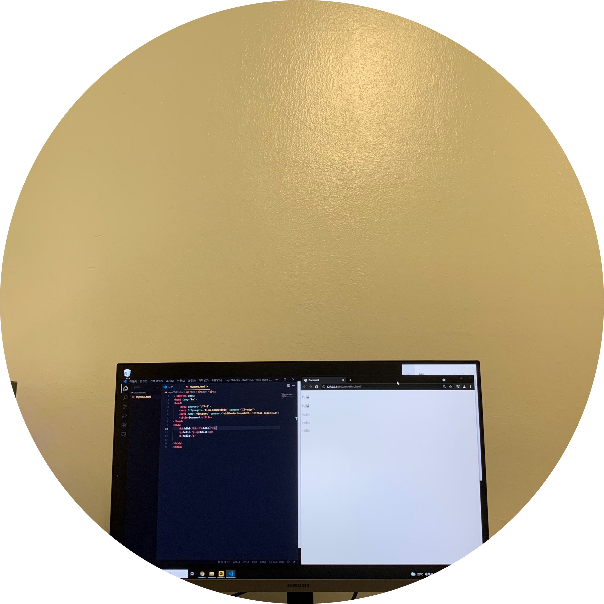

# HTML?
- "Hyper Text Mark-up Language" 의 약자. 웹 페이지의 모습을 기술하기 위한 규약. 프로그래밍 언어가 아니라 마크업 언어이다.

# HTML 기본 구조
```
<!DOCTYPE html>
<html>
<head>
  <title>title</title>
  <meta charset="utf-8" />
</head>
<body>

</body>
</html>
```

# HTML tag
  



 


Link: https://www.advancedwebranking.com/html/

- html tag에는 종류가 많기 때문에 자주 쓰이는 tag들을 제외한 나머지 tag들은 필요할때 찾아가면서 쓰는 것이 좋다.

# Link: https://zktm9903.github.io/studyHTML-CSS/myHTML
