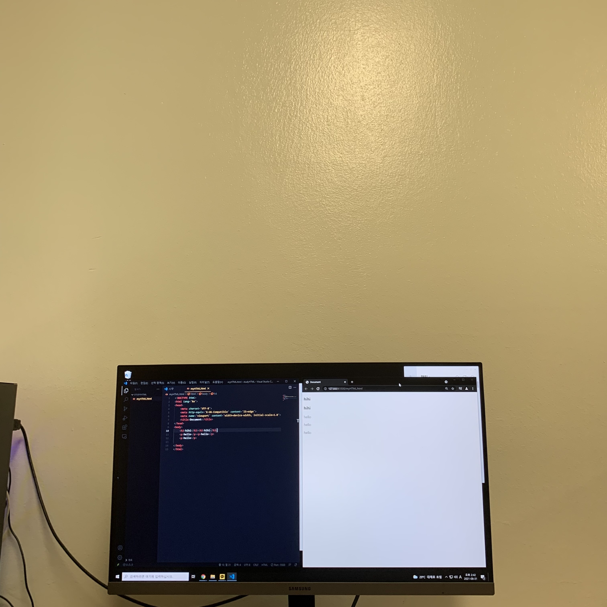
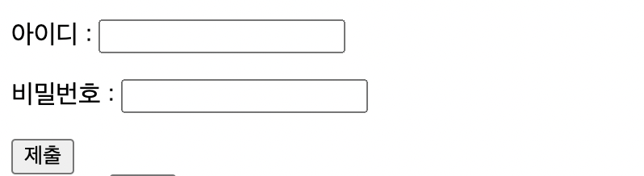

# HTML?
- "Hyper Text Mark-up Language" 의 약자. 웹 페이지의 모습을 기술하기 위한 규약. 프로그래밍 언어가 아니라 마크업 언어이다.

# HTML 기본 구조
```
<!DOCTYPE html>
<html>
<head>
  <title>title</title>
  <meta charset="utf-8" />
</head>
<body>

</body>
</html>
```
- head tag
  - 문서의 형태, 타이틀 정보, 스타일 정보, 자바스크립트에 대한 정보가 들어가는 부분
  - 웹 브라우저가 알아야 할 중요한 정보들이 들어가는 곳
  
- body tag
  - 정보 전달을 위한 데이터가 들어가는 부분
  - 화면에 직접 출력되는 부분

# HTML 구성요소
- 요소(Elements)
  - HTML에서 시작태그와 종료태그로 이루어진 모든 명령어들
- 태그(Tag)
  - 요소의 하나로서 시작태그와 종료태그로 이루어져 있음
  - ```
      <h1>hello my world!<h1/>
    ```
- 속성(Attributes)
  - 좀 더 구체화된 명령어
  - 요소의 시작태그안에 사용
  - 다양한 효과를 부여
  - ```
      <p font-size: 10px;>hello my world!<p/>
    ```
- 값(Arguments)
  - 속성과 관련된 값을 의미
# HTML tag
  
 
Link: https://www.advancedwebranking.com/html/

- html tag에는 종류가 많기 때문에 자주 쓰이는 tag들을 제외한 나머지 tag들은 필요할때 찾아가면서 쓰는 것이 좋다.

- 대표적인 태그 몇가지
  - ```
      <p>hello world!<p/>
    ```
    - <p>hello world!<p/>
  - ```
    
    ```
    - 
  - ```
      <table border="2">
        <tr>
            <td>이름</td>     <td>성별</td>   <td>주소</td>
        </tr>
        <tr>
            <td>땅땅이</td>  <td>남</td>      <td >대구</td>
        </tr>
        <tr>
            <td>춘식이</td>  <td>여</td>      <td>제주도</td>
        </tr>
      </table>
      ```
    - <table border="2">
        <tr>
            <td>이름</td>     <td>성별</td>   <td>주소</td>
        </tr>
        <tr>
            <td>땅땅이</td>  <td>남</td>      <td >대구</td>
        </tr>
        <tr>
            <td>춘식이</td>  <td>여</td>      <td>제주도</td>
        </tr>
      </table>

  - ```
      <form>
        <p>아이디 : <input type="text" name="id"></p>
        <p>비밀번호 : <input type="password" name="pwd"></p>
        <input type="submit">
      </form>
      ```
    - </img><br/> 
  - ```
      <select name="color">
        <option value="red">붉은색</option>
        <option value="black">검은색</option>
        <option value="blue">파란색</option>
      </select>
      <select name="color2" multiple>
        <option value="red">붉은색</option>
        <option value="black">검은색</option>
        <option value="blue">파란색</option>
      </select>
    ```
    - </img><br/> 
  - ```
    <p>
        <h1>색상(단일선택)</h1>
        붉은색 : <input type="radio" name="color" value="red">
        검은색 : <input type="radio" name="color" value="black" checked>
        파란색 : <input type="radio" name="color" value="blue">
    </p>
    <p>
        <h1>사이즈(다중선택)</h1>
        95 : <input type="checkbox" name="size" value="95">
        100 : <input type="checkbox" name="size" value="100" checked>
        105 : <input type="checkbox" name="size" value="105" checked>
    </p>
    ```
    - </img><br/>


---------------------------------
---------------------------------
# CSS?
- 종속형 시트 또는 캐스케이딩 스타일 시트(Cascading Style Sheets, CSS)는 마크업 언어가 실제 표시되는 방법을 기술하는 스타일 언어(style sheet language)로[1], HTML과 XHTML에 주로 쓰이며, XML에서도 사용할 수 있다. 기본 파일 명 W3C의 표준이며, 레이아웃과 스타일을 정의할 때의 자유도가 높다.
  
# CSS example
- html
  - ```
      <p class="cssName">hello my world!<p/>
    ```
- css
  - ```
      .cssName{
        font-size: 30px;
        text-align: center;
      }
    ```
- result
  - </img><br/>
  

# CSS selector
- id
  - ```
      <p id="idName">hello my world!<p/>
    ```
  - ```
      #idName{
        ...
      }
    ```
- class
  - ```
      <p class="className">hello my world!<p/>
    ```
  - ```
      #className{
        ...
      }
    ```
- tag
  - ```
      <p>hello my world!<p/>
    ```
  - ```
      p{
        ...
      }
    ```
- 더 많은 css selector를 공부하고 싶다면
  - Link: https://flukeout.github.io/

# CSS selector 우선순위
- id > class > tag
  - ```
      <p class="className" id="idName">hello my world!<p/>
    ```
  - ```
      .className{
        font-style: italic;
        color: blue;
      }

      #idName{
        color: red;
      }
    ```
  - </img><br/>
    - 겹치는 속성만 우선순위로 결정되고 나머지 부분들은 적용이 된다.
------------------------------
------------------------------
- 예시 사이트 : https://zktm9903.github.io/studyHTML-CSS/myHTML
  - html file 경로 = ./myHTML.html
  - css file 경로 = ./css/myCSS.css
